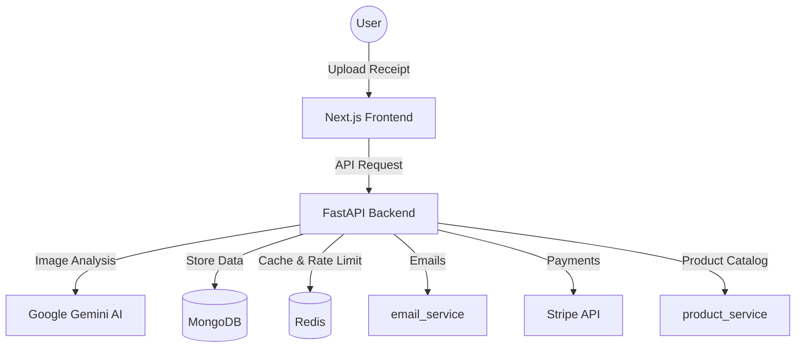

# 🌿 EcoCart: AI-Powered Sustainable Shopping 🌍

[](https://opensource.org/licenses/MIT)
[](https://fastapi.tiangolo.com)
[](https://nextjs.org)
[](https://ai.google.dev/)

**Shop smarter for the planet.** EcoCart is a modern, AI-driven platform that helps you understand your environmental impact by analyzing shopping receipts, calculating carbon footprints, and recommending sustainable alternatives.

---

## ✨ Features at a Glance

| | |
| :--- | :--- |
| 📸 **Receipt AI** | Upload any receipt; Google Gemini 3.5 Flash identifies products and calculates CO₂ in seconds. |
| 🌱 **Eco Score** | Understand your footprint with a 0-100 sustainability score based on Life Cycle Assessment (LCA). |
| 🛒 **Smart Swaps** | Get personalized, eco-friendly product recommendations with direct purchase links. |
| 💳 **Offsetting** | Neutralize your impact by funding verified carbon projects (reforestation, renewable energy, etc.). |
| 🏆 **Gamified Impact** | Earn badges, level up, and compete on the global leaderboard as an Eco Warrior. |

---

## 🎨 Visual Preview

<div align="center">
  
  
</div>

---

## 🏗 System Architecture



---

## 🚀 Getting Started

The project is structured as a mono-repo for easy development.

### 1. Prerequisites
- Python 3.10+
- Node.js 20+
- MongoDB & Redis (or use Docker)

### 2. Backend Setup
```bash
cd backend
python -m venv venv
source venv/bin/activate  # or venv\Scripts\activate on Windows
pip install -r requirements.txt
cp .env.example .env      # Fill in Gemini & MongoDB keys
python run.py
```

### 3. Frontend Setup
```bash
cd frontend
npm install
cp .env.example .env.local # Add NEXT_PUBLIC_API_URL
npm run dev
```

---

## 🐳 Docker Support

Spin up the entire stack (API, DB, Redis) with a single command:

```bash
docker-compose up -d
```

---

## 📡 API Endpoints (v1)

- **Auth**: `/api/v1/auth/` (Google & Local)
- **Analyze**: `/api/v1/analyze/` (Receipt processing)
- **Products**: `/api/v1/products/` (Catalog & Suggestions)
- **Users**: `/api/v1/users/` (Profile & Dashboard)
- **Offsets**: `/api/v1/carbon-offsets/` (Impact tracking)

---

## 🛡 Security & Best Practices

- **JWT Authentication** — Secure token-based sessions.
- **Rate Limiting** — Preventing abuse with `slowapi`.
- **GDPR Compliant** — Right to erasure and data portability built-in.
- **Modern UI** — Built with Tailwind CSS, Shadcn/UI, and Radix Primitives.

---

## 📝 License

MIT © [EcoCart](https://github.com/Yash-Bharvada/EcoCart) 2024
